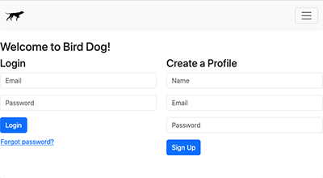
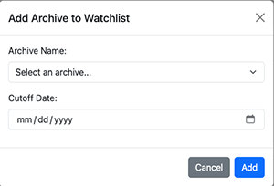
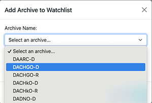
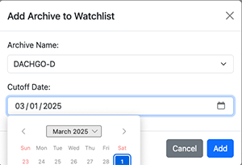

# Bird Dog Help

Welcome to the Bird Dog help page!

## What is Bird Dog?

Bird Dog is a web-based navigator and translator for Ukrainian documents hosted on [WikiSource](https://uk.wikisource.org). It allows users to track and evaluate changes to Wiki page content and export spreadsheet updates for further downstream processing by the Ukranian Data Acquisition team at Jewish Gen.

### Getting Started

1. [Create a profile or log in](#create-profile-or-login)
3. [Add archives to your watchlist](#add-archives-to-your-watchlist) (Bird Dog will notify you of new documents as they appear.)
5. [Explore page change notifications](#explore-page-changes)
6. [Examine page details through the Browse panel](#browse-archive-pages)

## Create Profile or Login

On your first visit, you need to create a profile by providing your name, email address, and password. 
On future visits, you will need your email and password to login. Your email is your Bird Dog ID, and also will be needed if you ever forget your password.

## Add Archives to your Watchlist

Your first step is to let Bird Dog know which Archives you want to monitor. Simply select the archive from the drop down. You also need to provide a cutoff date. Bird Dog will report any ongoing changes to the selected archive on or after the cutoff date. Click "Add" when you're ready. Bird Dog will take a few seconds to collect the page updates for you to review.

### Watch List Controls

####  Add an(other) archive to your Watch List.

####  Remove an archive from your Watch List. (Note: your "resolve" history for this archive will be lost if you do this.)

####  Check this archive for any new updates.
 
## Explore Page Cha)nges

## Browse Archive Pages

### Translate Page

Click the “Translate” button on any document page to initiate machine translation. You can monitor progress in real time.

### Download Spreadsheet

### Resolve Updates

## Questions?

Contact the [Bird Dog Pound](mailto:birddogpound2025@gmail.com) or open an issue in [GitHub Issues](https://github.com/jbrandt130/birddog/issues).
