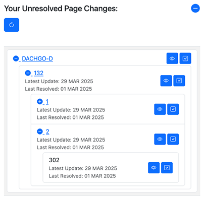
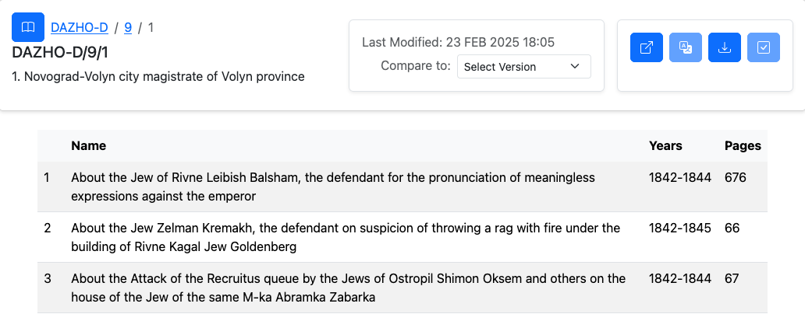
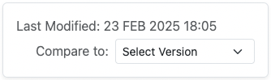
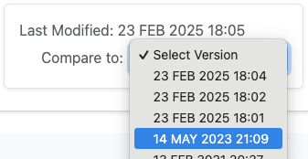
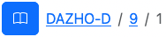

# Welcome to Bird Dog!

Bird Dog is a web-based navigator and translator for Ukrainian documents hosted on [WikiSource](https://uk.wikisource.org). It allows users to track and evaluate changes to Wiki page content and export spreadsheet updates for further downstream processing by the Ukranian Data Acquisition team at Jewish Gen.

### Getting Started

1. [Create a profile or log in](#create-profile-or-login)
3. [Add archives to your watchlist](#add-archives-to-your-watchlist) (Bird Dog will notify you of new documents as they appear.)
5. [Explore page change notifications](#explore-unresolved-page-changes)
6. [Examine page details through the Browse panel](#browse-archive-pages)

## Create Profile or Login

On your first visit, you need to create a profile by providing your name, email address, and password. 
On future visits, you will need your email and password to login. Your email is your Bird Dog ID, and also will be needed if you ever forget your password.

## Add Archives to your Watchlist

Your first step is to let Bird Dog know which Archives you want to monitor. Simply select the archive from the drop down. You also need to provide a cutoff date. Bird Dog will report any ongoing changes to the selected archive on or after the cutoff date. Click "Add" when you're ready. Bird Dog will take a few seconds to collect the page updates for you to review.

### Watch List Controls

####  Add an(other) archive to your Watch List.

####  Remove an archive from your Watch List. (Note: your "resolve" history for this archive will be lost if you do this.)

####  Check this archive for any new updates.
 
## Explore Unresolved Page Changes

Any page changes are organized into a tree navigator that enables you to traverse down to any fond, opus, or case of interest. If there has been a change to one of the Wiki pages, then the date of the most recent change, as well as the last resolved date are displayed. You can resolve any changes (and removed them from the unresolved list by clicking the check button. If you want to examine the changes more closely, then use the "eye" button to view the page content in the Browse panel.

### Unresolved Page Change Controls

####  View the page updates in the Browse panel.

####  Resolve this change. (All unresolved changes in subsidiary pages are also resolved.)

####  Check all watch list archives for updates. (This is done automatically whenever you login or reload Bird Dog.)

## Browse Archive Pages

The Browse panel is your way to navigate all of the WikiData archives available to Bird Dog. A typical page (fond, opus, or case) consists of a header section followed by a table where each row of the table is a subsidiary page. You can click on any row of the table to visit the corresponding subsidiary. A row that is greyed out is unlinked and cannot be visited.

### Page Header Controls

Here are the controls available in the page's header section.

#### Page History

The current modification date of this page along with a dropdown containing prior versions are displayed in this box.

 
   
Compare to a prior version of the page by opening the dropdown and selecting a prior version date. When comparing, you see only those parts of the page that have been changed or added since the prior version. Additions are in green and changes are in yellow. If you see a yellow link icon, then the link has been changed. A green link icon indicates a link has been added.

To stop comparing, open the dropdown and select "Stop Comparing".

####  The breadcrumb enables you to click on any of the parent page names to upward in the page hierarchy.

Note that the web page "Back" button currently navigates away from Bird Dog.

####  Select an archive to browse.

####  Open this page on the WikiData site in a separate window.

####  Translate this page to English. 

Note that the entire page is translated, which can take a long time for some pages. The progress bar displays translation progress and an animated badge signifies that a page is in the process of translation. You can continue working while the page is being translated, including going to other pages, or switching to the home panel. 

####  Download the Excel spreadsheet for this page.

If the page has not been translated, then the downloaded sheet will also not be translated. If you are viewing in comparison mode, then the downloaded spreadsheet will highlight the changes.

####  Resolve the update for this page (and any subsidiaries).

### Badges

Several different badges can appear in the header section of the page to inform you of a particular condition for the current page. Their meanings are as follows.

####  This page has no revision history. 

The displayed page is the only revision available.

####  This page is being translated.

Translation progress is indicated by the progress bar. Translation continues even if you navigate away while a page is being translated. Note that the entire page is translated even if you are only viewing the differences for a given page to a prior version.

####  This page (or a subsidiary) has an unresolved update.

There is an updated for this page or one of its subsidiaries that needs to be resolved. You can click on the Resolve button to resolve it.

####  This page has no subsidiary pages. 

Consequently, this page will have no table rows displayed. (Note that some pages have a table header even though there are no subsidiary pages. In this case, Bird Dog will show the table header only.)

####  You are viewing a comparison of the current version of this page with the prior version selected from the revision history.

Text changes are shown in yellow. Text additions are in green. If you see a yellow link icon, then the link has changed. A green link icon indicates a link has been added. Note that rows that are completely unchanged are hidden in this view. Downloading the page while in comparison mode results in an Excel spreadsheet with the changes highlighted

####  There is no significant difference between the current version and the prior version currently being compared.

When comparing a page to a prior version, it is possible that there is no difference in the data that Bird Dog attends to. It could be that some other part of the page was changed, such as metadata. In this case, you will not see any highlighted changes on the page.

## Questions?

Contact the [Bird Dog Pound](mailto:birddogpound2025@gmail.com) or open an issue in [GitHub Issues](https://github.com/jbrandt130/birddog/issues).
