# Welcome to Birddog!

Birddog is a web-based navigator and translator for Ukrainian documents hosted on [WikiSource](https://uk.wikisource.org). It allows users to track and evaluate changes to Wiki page content and export spreadsheet updates for further downstream processing by the Ukranian Data Acquisition team at Jewish Gen.

### Getting Started

1. [Create a profile or log in](#create-profile-or-login)
2. [Add archives to your watchlist](#add-archives-to-your-watchlist) (Birddog will notify you of new documents as they appear.)
3. [Explore page change notifications](#explore-unresolved-page-changes)
4. [Examine page details through the Browse panel](#browse-archive-pages)

## Navigating Birddog

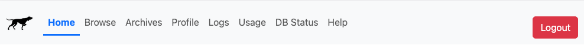

Once logged in, the navigation bar at the top of the page gives you access to:

- **Home** — your watchlist and unresolved page changes (this is where you land after login).
- **Browse** — the page viewer described in [Browse Archive Pages](#browse-archive-pages) below.
- **Archives** — a master list of all archives Birddog knows about; see [Archives](#archives).
- **Profile** — change your password; see [Your Profile](#your-profile).
- **Logs**, **Usage**, **DB Status** — diagnostic pages useful for troubleshooting; see [Diagnostics](#diagnostics).
- **Help** — opens this document.

## Create Profile or Login

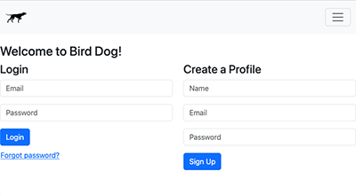

On your first visit, you need to create a profile by providing your name, email address, and password. 
On future visits, you will need your email and password to login. Your email is your Birddog ID, and also will be needed if you ever forget your password.

If you forget your password, click "Forgot password?" below the login form and enter your email. Birddog will send you a password reset link by email.

## Add Archives to your Watchlist

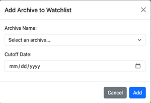
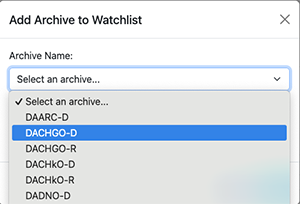
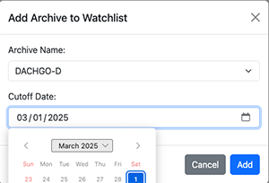

Your first step is to let Birddog know which Archives you want to monitor. Simply select the archive from the drop down. You also need to provide a cutoff date. Birddog will report any ongoing changes to the selected archive on or after the cutoff date. Click "Add" when you're ready. Birddog will take a few seconds to collect the page updates for you to review.

### Watch List Controls

####  Add an(other) archive to your Watch List.

#### 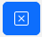 Remove an archive from your Watch List. (Note: your "resolve" history for this archive will be lost if you do this.)

####  Check this archive for any new updates.
 
## Explore Unresolved Page Changes

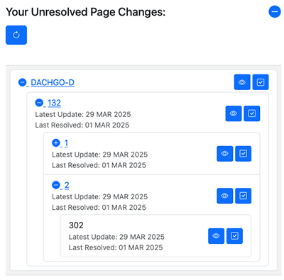

Any page changes are organized into a tree navigator that enables you to traverse down to any fond, opus, or case of interest. If there has been a change to one of the Wiki pages, then the date of the most recent change, as well as the last resolved date are displayed. You can resolve any changes (and removed them from the unresolved list by clicking the check button. If you want to examine the changes more closely, then use the "eye" button to view the page content in the Browse panel.

### Unresolved Page Change Controls

####  View the page updates in the Browse panel.

#### 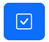 Resolve this change. (All unresolved changes in subsidiary pages are also resolved.)

####  Check all watch list archives for updates. (This is done automatically whenever you login or reload Birddog.)

## Browse Archive Pages

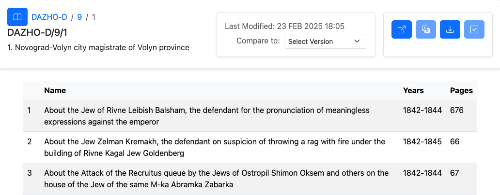

The Browse panel is your way to navigate all of the WikiData archives available to Birddog. A typical page (fond, opus, or case) consists of a header section followed by a table where each row of the table is a subsidiary page. You can click on any row of the table to visit the corresponding subsidiary. A row that is greyed out is unlinked and cannot be visited.

### Page Header Controls

Here are the controls available in the page's header section.

#### Page History

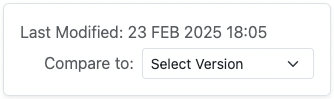

The current modification date of this page along with a dropdown containing prior versions are displayed in this box.

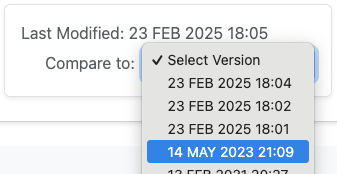 
   
Compare to a prior version of the page by opening the dropdown and selecting a prior version date. When comparing, you see only those parts of the page that have been changed or added since the prior version. Additions are in green and changes are in yellow. If you see a yellow link icon, then the link has been changed. A green link icon indicates a link has been added.

To stop comparing, open the dropdown and select "Stop Comparing".

#### Page Description

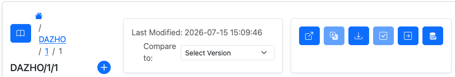

Below the page title is a "+" button that expands a collapsible box showing the page's description, dates, and, if one is available, a link to the associated source document.

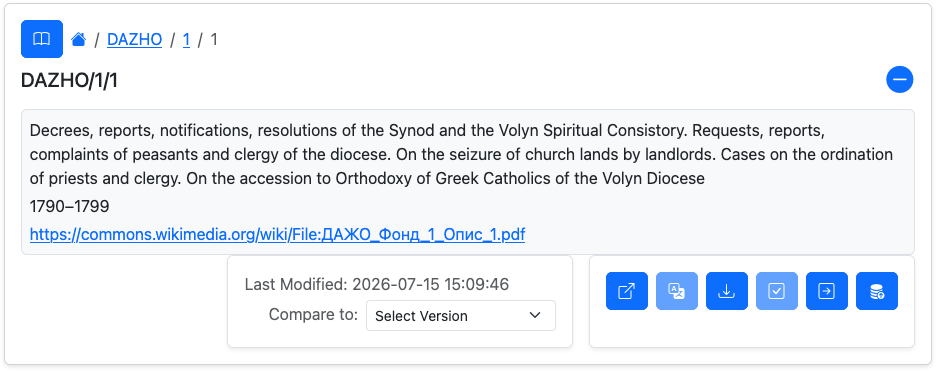

Once expanded, the "+" becomes a "−" button that collapses the box again. Like other page content, the description and document link are highlighted green or yellow when comparing to a prior version, to indicate they were added or changed.

#### 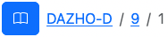 The breadcrumb enables you to click on any of the parent page names to upward in the page hierarchy.

Note that the web page "Back" button currently navigates away from Birddog.

####  Select an archive to browse.

####  Open this page on the WikiData site in a separate window.

#### 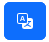 Translate this page to English. 

Note that the entire page is translated, which can take a long time for some pages. The progress bar displays translation progress and an animated badge signifies that a page is in the process of translation. You can continue working while the page is being translated, including going to other pages, or switching to the home panel. 

####  Download the Excel spreadsheet for this page.

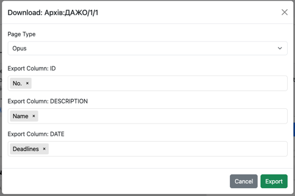

This opens an export dialog where you choose a Page Type template, then map each export column (ID, Description, Date, etc.) to the corresponding source field, before downloading. If the page has not been translated, then the downloaded sheet will also not be translated. If you are viewing in comparison mode, then the downloaded spreadsheet will highlight the changes.

####  Resolve the update for this page (and any subsidiaries).

####  Next Unresolved

Jumps directly to the next unresolved page, in the same order they appear in the [Unresolved Page Changes](#explore-unresolved-page-changes) list. This button is only enabled when there is a next unresolved page to go to.

#### 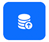 Upload this page (and optionally any subsidiaries) to the database.

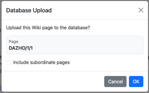

This button only appears when a database backend is configured for this deployment. It opens a confirmation dialog showing the page title and an "Include subordinate pages" checkbox; confirm to upload the page (and, if checked, its subordinate pages) to the database.

### Badges

Several different badges can appear in the header section of the page to inform you of a particular condition for the current page. Their meanings are as follows.

####  This page has no revision history. 

The displayed page is the only revision available.

####  This page is being translated.

Translation progress is indicated by the progress bar. Translation continues even if you navigate away while a page is being translated. Note that the entire page is translated even if you are only viewing the differences for a given page to a prior version.

####  This page (or a subsidiary) has an unresolved update.

There is an updated for this page or one of its subsidiaries that needs to be resolved. You can click on the Resolve button to resolve it.

####  This page has no subsidiary pages. 

Consequently, this page will have no table rows displayed. (Note that some pages have a table header even though there are no subsidiary pages. In this case, Birddog will show the table header only.)

####  You are viewing a comparison of the current version of this page with the prior version selected from the revision history.

Text changes are shown in yellow. Text additions are in green. If you see a yellow link icon, then the link has changed. A green link icon indicates a link has been added. Note that rows that are completely unchanged are hidden in this view. Downloading the page while in comparison mode results in an Excel spreadsheet with the changes highlighted

####  There is no significant difference between the current version and the prior version currently being compared.

When comparing a page to a prior version, it is possible that there is no difference in the data that Birddog attends to. It could be that some other part of the page was changed, such as metadata. In this case, you will not see any highlighted changes on the page.

## Your Profile

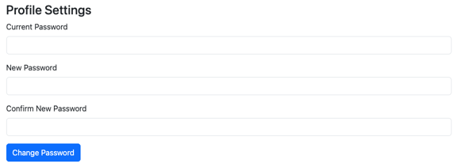

The Profile tab lets you change your password at any time. Enter your current password along with the new password (twice, to confirm) and submit the form.

## Archives

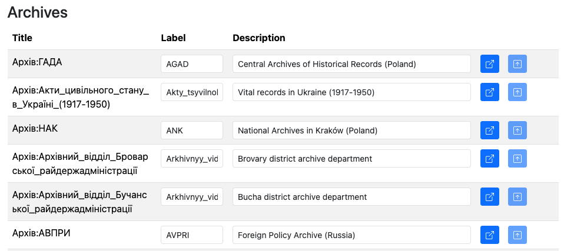

The Archives tab lists every archive Birddog knows about, with its title, a short label, and a description. Clicking anywhere on a row (other than its buttons) opens that archive in the Browse panel. The "View Source" button opens the archive directly on WikiSource in a new tab. This is the same list of archives offered when adding an archive to your watchlist or selecting one to browse.

Editing the Label and Description fields is only available to admin users; a save button (enabled once you've made a change) appears in the last column for admins to commit edits to a row. Regular users see the label and description as read-only text.

## Diagnostics

Three links in the nav bar open diagnostic pages in a new tab, mainly useful when troubleshooting:

- **Logs** — recent service log entries. Use the "Show latest" dropdown to choose how many entries to display, and click Refresh to pull the latest logs — the page does not update automatically.

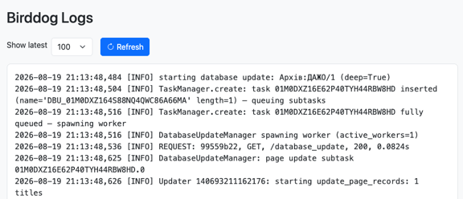

- **Usage** — a service usage dashboard, broken down by backend resource (translation, database, storage, etc.). Choose a time range, and optionally check "Summarize By Resource" for per-resource totals instead of a detailed breakdown.

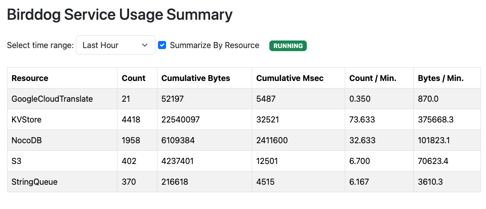

Larger time ranges take longer to compute; the longest ranges can be slow enough to time out at the AWS level.

- **DB Status** — a list of active database-upload tasks (from the [Upload to database](#browse-archive-pages) feature), each with its kind, description, size, progress, and whether it's a "deep" (page + subordinates) upload.

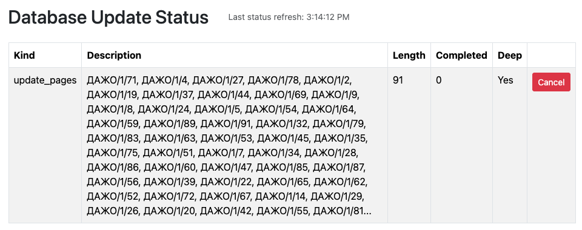

Each task row has a Cancel button. **Only cancel a task if you know what you're doing** — cancelling an in-progress database upload partway through can leave the database in an inconsistent state.

## Questions?

Contact the [Birddog Pound](mailto:birddogpound2025@gmail.com) or open an issue in [GitHub Issues](https://github.com/jbrandt130/birddog/issues).
